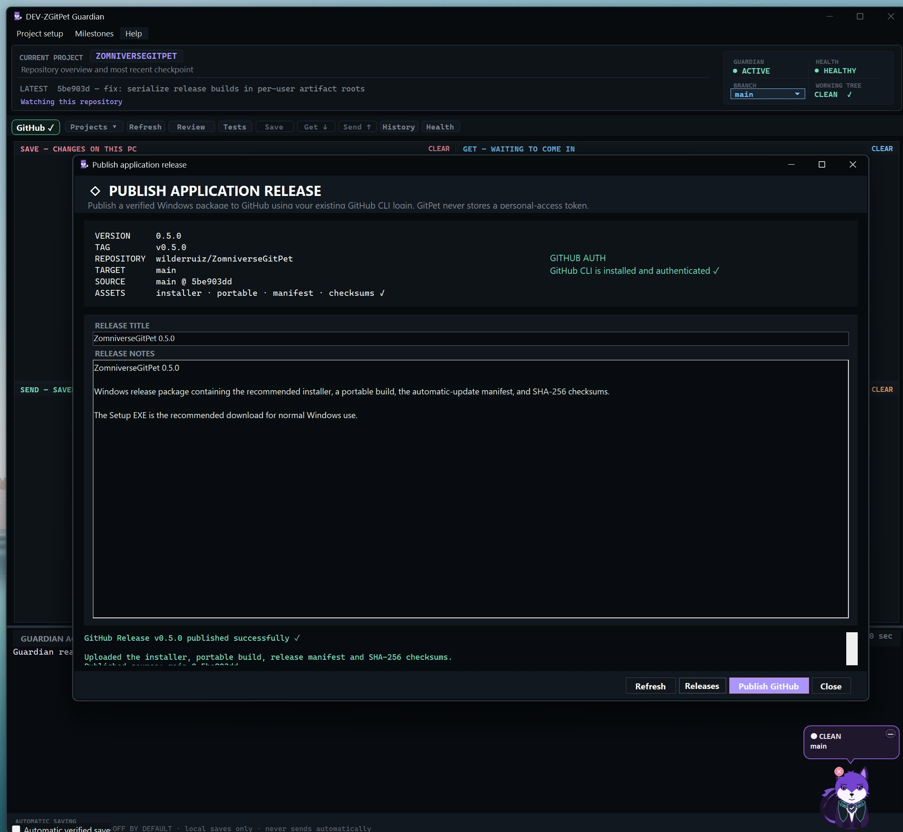
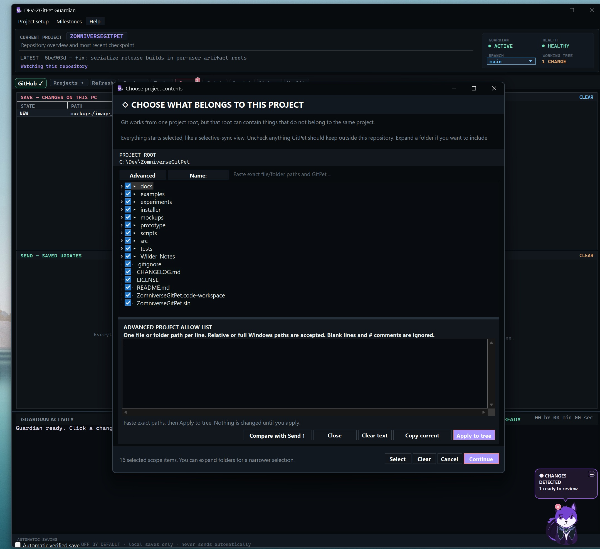
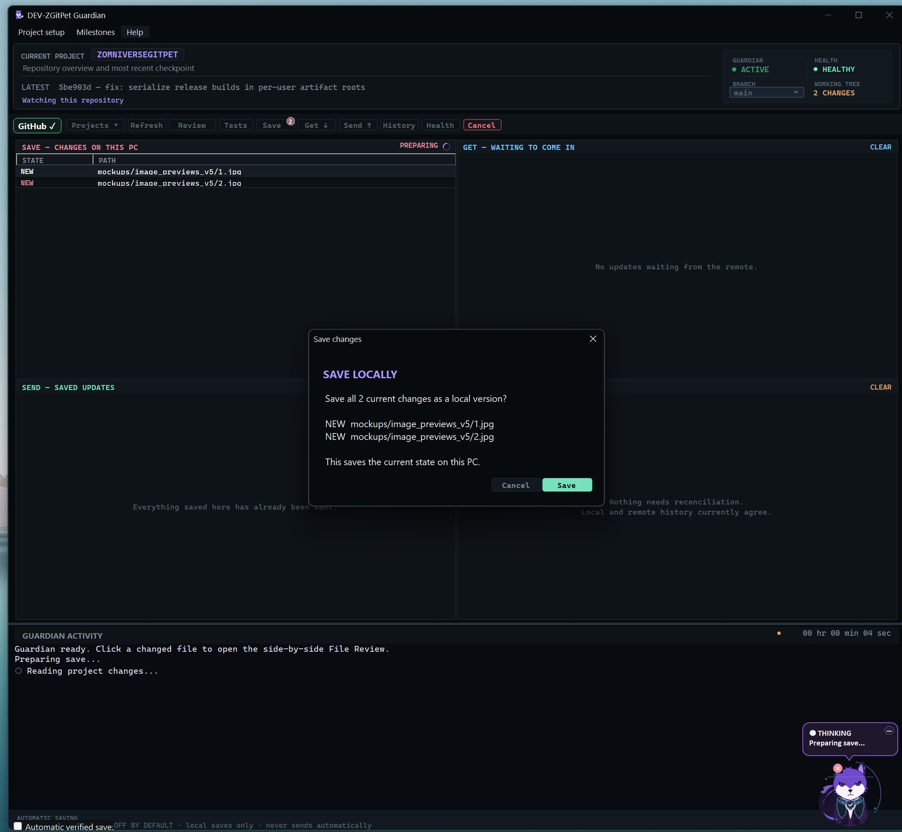
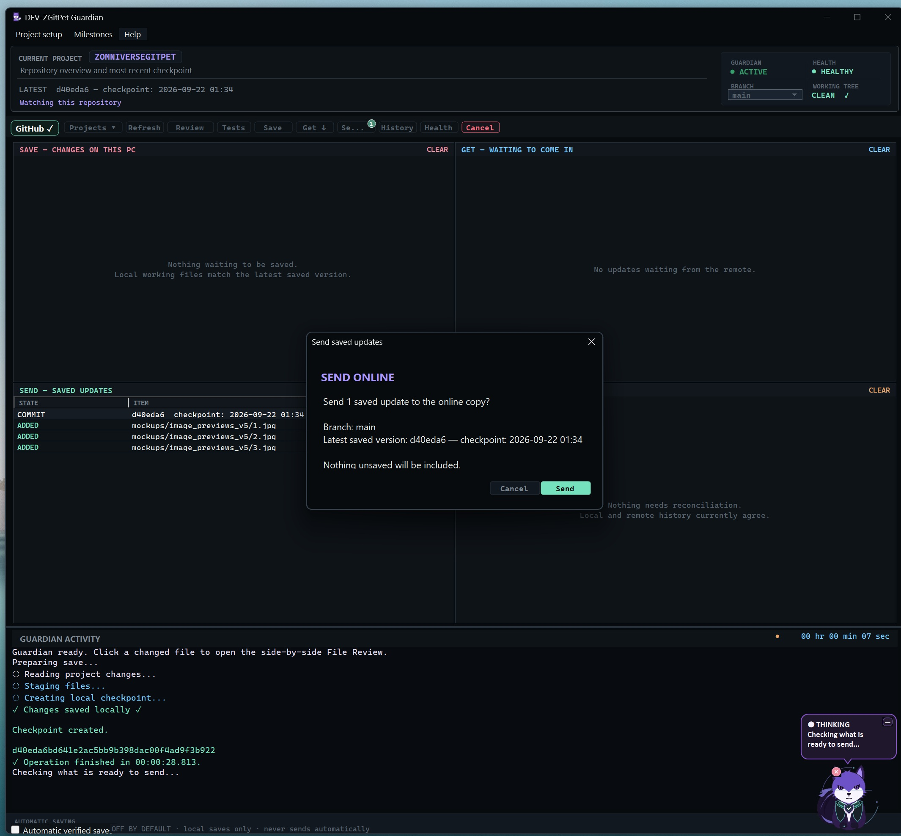

<p align="center">
  
</p>

<h1 align="center">ZomniverseGitPet</h1>

<p align="center"><strong>A desktop Git guardian for human + AI-assisted development.</strong></p>

<p align="center">
  <strong>Windows 10 / 11 x64</strong>
  &nbsp;•&nbsp;
  <strong>.NET 8</strong>
  &nbsp;•&nbsp;
  <strong>Native Direct2D / DirectX Guardian</strong>
  &nbsp;•&nbsp;
  <strong>MIT</strong>
</p>

<p align="center">
  <strong>Review what changed → Save locally → Get remote work → Send saved work → Reconcile safely</strong>
</p>

ZomniverseGitPet turns everyday Git safety into a visible desktop workflow. Instead of hiding repository state behind terminal commands, GitPet keeps the important states in front of you: what changed on this PC, what is waiting remotely, what you have already saved, and whether local and remote histories still agree.

The application combines a dark **Guardian Command Center** with a small live purple **Direct2D Guardian** on the desktop. The Guardian reacts to repository state and Git operations with expressions, tail movement, palette changes, armor transitions, traffic effects, warning/failure behavior, and resting animation.

GitPet is especially useful when several humans or AI coding agents are touching the same codebase: work can arrive remotely, be reviewed locally, tested, saved as an ordinary Git commit, and explicitly sent only after you decide it is ready.

> Current application version: **0.5.0** · Native .NET 8 WinForms · Windows x64 · Git for Windows  
> Installer and portable builds are published through this repository's [GitHub Releases](../../releases) page.

---

## v0.5 at a glance

<table>
  <tr>
    <td width="25%"><strong>SAVE</strong><br><sub>Unsaved changes on this PC. Review them and create an ordinary local checkpoint.</sub></td>
    <td width="25%"><strong>GET ↓</strong><br><sub>Remote updates waiting to come in. Fast-forward or scoped-project safety rules apply.</sub></td>
    <td width="25%"><strong>SEND ↑</strong><br><sub>Already-saved local updates waiting to be sent. Unsaved work is never included.</sub></td>
    <td width="25%"><strong>RECONCILE</strong><br><sub>Local and remote histories disagree. GitPet surfaces the state instead of guessing.</sub></td>
  </tr>
</table>

The v0.5 generation adds:

- a graphite **four-quadrant workboard** for SAVE / GET / SEND / RECONCILE;
- the production **160 × 160 live Direct2D Guardian**;
- activity-specific animation for **Thinking, Preparing, Sorting, Packing, Incoming, Outgoing, Reconciling, Success, Warning, Failure, and Resting**;
- whole-pet traffic, scan, orbit, warning, collision/recoil, sleep, and tail effects designed to remain readable at desktop-pet size;
- animated dark armor with cool-blue ↔ **Forest Emerald** transitions while preserving the selected Guardian palette;
- DPI-aware native rendering with automatic fallback to the embedded PNG/GDI+ pet states if Direct2D cannot initialize or render;
- safer logical-project scopes, allow-list boundaries, standalone publishing, project branch selection, and scoped Get behavior;
- clearer GitHub connection/setup flows and release provenance checks;
- an in-app **Prepare application release** workflow that runs the real build/test/installer/hash pipeline before the separate Publish step;
- expanded onboarding, project switching, File Review, operation feedback, update handling, and regression coverage.

---

<h2>V5 interface showcase</h2>

<p>
These are the current v0.5 screenshots from the application itself: the redesigned Command Center, workboard, Guardian activity area, and the new desktop-pet generation.
</p>

<table>
  <tr>
    <td width="50%" align="center">
      
    </td>
    <td width="50%" align="center">
      
    </td>
  </tr>
  <tr>
    <td width="50%" align="center">
      
    </td>
    <td width="50%" align="center">
      
    </td>
  </tr>
</table>

<p align="center"><sub>V5 screenshots are stored in <code>mockups/image_previews_v5/</code> and render directly from this repository.</sub></p>

---

<h2>See the workflow in motion</h2>

The repository includes the new motion previews directly:

<table>
  <tr>
    <td width="50%" align="center">
      <a href="mockups/video_previews_for_readme/save-get-actions.mp4">
        
      </a>
      <br>
      <strong><a href="mockups/video_previews_for_readme/save-get-actions.mp4">▶ Save / Get actions</a></strong>
      <br><sub>Open the repository-hosted MP4 preview.</sub>
    </td>
    <td width="50%" align="center">
      <a href="mockups/video_previews_for_readme/get.mp4">
        
      </a>
      <br>
      <strong><a href="mockups/video_previews_for_readme/get.mp4">▶ Get / incoming update</a></strong>
      <br><sub>Open the repository-hosted MP4 preview.</sub>
    </td>
  </tr>
</table>

---

<h2>The live Direct2D Guardian</h2>

The desktop mascot is no longer just a collection of static state images. In v0.5 the normal production path is a native **Direct2D** renderer — part of the Windows DirectX graphics stack — drawing the Guardian as live vector geometry at a real **160 × 160** desktop footprint.

The renderer was developed and A/B-tested in the isolated **Lynx Lab** harness before being promoted into the shipping `PetForm`. Production does not depend on the experiment folder: the validated renderer and Guardian model have their own source under `src/ZomniverseGitPet/`.

<table>
  <tr><th>Guardian behavior</th><th>What it communicates</th></tr>
  <tr><td><strong>Idle / Clean</strong></td><td>Repository is quiet and healthy; subtle breathing, blinking and tail motion remain active.</td></tr>
  <tr><td><strong>Thinking / Preparing</strong></td><td>Scanning and inspection motion around the whole Guardian.</td></tr>
  <tr><td><strong>Sorting / Packing</strong></td><td>Moving data cues and inward-locking motion while work is prepared for a local checkpoint.</td></tr>
  <tr><td><strong>Incoming</strong></td><td>Independent traffic moves from the perimeter toward the Guardian at different speeds.</td></tr>
  <tr><td><strong>Outgoing</strong></td><td>The same traffic language reverses and moves away from the Guardian.</td></tr>
  <tr><td><strong>Reconciling</strong></td><td>Opposing/orbiting flows represent two histories being brought together.</td></tr>
  <tr><td><strong>Success</strong></td><td>Brighter success halo and pleased expression.</td></tr>
  <tr><td><strong>Warning</strong></td><td>Counter-rotating perimeter motion with a large rocking yellow alert.</td></tr>
  <tr><td><strong>Failure</strong></td><td>Collision/recoil effects with stronger red/purple eye emphasis.</td></tr>
  <tr><td><strong>Resting</strong></td><td>Quiet outward-fading rings, drifting sleep glyphs, and slower relaxed tail movement.</td></tr>
</table>

The Direct2D surface is DPI-aware and the app keeps the previous embedded PNG pet states as a fallback. If native Direct2D initialization or rendering fails, GitPet automatically returns to that fallback instead of losing the desktop companion.

Key production sources:

| Source | Responsibility |
| --- | --- |
| `src/ZomniverseGitPet/PetForm.cs` | Desktop host, state priority, bubble/tray interaction and fallback orchestration |
| `src/ZomniverseGitPet/PetDirect2DControl.cs` | Native Direct2D path geometry, rendering, animation and activity FX |
| `src/ZomniverseGitPet/PetGuardianModel.cs` | Guardian palettes and shared state/activity model |
| `experiments/LynxLab/` | Isolated renderer-development and A/B validation harness |

---

<h2>Guardian Command Center</h2>

The main window is intentionally organized around repository state instead of raw Git terminology.

<table>
  <tr>
    <th width="50%">SAVE — CHANGES ON THIS PC</th>
    <th width="50%">GET — WAITING TO COME IN</th>
  </tr>
  <tr>
    <td>Working-tree changes that have not yet been saved as a local checkpoint.</td>
    <td>Remote work that is not yet present in the active local/project state.</td>
  </tr>
  <tr>
    <th>SEND — SAVED UPDATES</th>
    <th>RECONCILE — HISTORIES</th>
  </tr>
  <tr>
    <td>Local saved commits/updates that have not yet been sent to the configured destination.</td>
    <td>Diverged or otherwise incompatible histories that need explicit reconciliation.</td>
  </tr>
</table>

Above the workboard, GitPet keeps the current project, branch, repository health, working-tree state and latest checkpoint visible. The toolbar uses human-first actions:

<strong>GitHub ✓ · Projects · Refresh · Review · Tests · Save · Get ↓ · Send ↑ · History · Health</strong>

The lower **Guardian Activity** area shows the foreground operation without allowing quiet background polling to masquerade as user-requested work.

---

<h2>File Review</h2>

Click a changed file and GitPet opens a resizable side-by-side comparison:

<table>
  <tr>
    <th width="50%">BEFORE / SAVED</th>
    <th width="50%">NOW / CURRENT</th>
  </tr>
  <tr>
    <td>Latest local checkpoint / commit</td>
    <td>Current file on disk</td>
  </tr>
  <tr>
    <td>Human summary or technical source</td>
    <td>Human summary or technical source</td>
  </tr>
  <tr>
    <td>Changed baseline lines highlighted</td>
    <td>Changed current lines highlighted</td>
  </tr>
</table>

New files explicitly show that no saved version existed. Deleted files show that the current version is gone. Binary and very large files stay protected from accidental text rendering.

Untracked folders are expanded to individual files, so a new source file can be reviewed directly rather than appearing as one opaque directory.

---

<h2>Save, Get, Send and Reconcile</h2>

<h3>Save</h3>

**Save is local.** GitPet previews the current non-ignored changes, confirms what will be included, verifies Git author identity, and creates an ordinary local Git commit/checkpoint. Saving never sends anything automatically.

<h3>Get ↓</h3>

For an ordinary tracked branch, Get requires a clean working tree and uses fast-forward-only safety:

```bash
git pull --ff-only origin <current-branch>
```

If histories diverge, Get stops rather than creating a merge behind your back.

For a **scoped logical project with its own standalone remote**, Get uses an isolated workspace instead: it fetches the selected standalone branch, verifies incoming paths remain inside the configured project scope, then copies only those project files back as unsaved changes. Parent-repository history is not silently merged or switched.

<h3>Send ↑</h3>

Send works with already-saved updates only. New unsaved work sitting on top of those commits is excluded.

For an ordinary repository the underlying operation is:

```bash
git push origin <current-branch>
```

GitPet never force-pushes `main`, never stages or commits as a side effect of Send, and never creates a remote repository merely because you clicked Send.

<h3>Reconcile</h3>

When local and remote histories no longer agree, GitPet moves the situation into the dedicated **RECONCILE — HISTORIES** quadrant. The goal is visibility and explicit choice: GitPet does not hide divergence behind an automatic merge.

See [Save, Get, Send](docs/user/SAVE_GET_SEND.md) and [Reconciliation](docs/user/RECONCILIATION.md).

---

<h2>Logical projects, scopes and standalone publishing</h2>

One repository can contain several logical projects without pretending they are separate Git roots.

GitPet can remember a project scope, enforce an allow list, and compare that boundary with what Send would actually publish. Scoped projects can also use a **standalone remote and branch** through an isolated publishing workspace.

That means remote work can happen independently — including work from remote/AI agents — while GitPet keeps the local source-of-truth boundary explicit.

Important safety properties include:

- project allow lists are reviewable and persistent;
- Send can be blocked when the saved scope and actual publish boundary disagree;
- standalone publishing does not merge unrelated parent-repository history;
- standalone Get validates incoming paths before copying them into the source workspace;
- branch switching is blocked while unresolved project work is waiting to Save, Get, Send or Reconcile.

See [Logical Projects](docs/user/LOGICAL_PROJECTS.md), [Allow Lists](docs/user/ALLOW_LISTS.md), [Project Boundaries](docs/safety/PROJECT_BOUNDARIES.md), and [Publishing Architecture](docs/developer/PUBLISHING_ARCHITECTURE.md).

---

<h2>Projects, GitHub and repository setup</h2>

GitPet can open an existing Git repository or safely prepare an ordinary folder after you review what belongs to the project.

For a new local repository, the actual initialization command is ordinary Git:

```bash
git init -b main
```

Preparation does **not** automatically create an online repository, stage files, Save, Get or Send.

If an existing project needs a remote, GitPet can connect an explicitly supplied clone URL as `origin`. GitHub-specific flows can use the authenticated GitHub CLI; GitPet does not store a personal-access token itself.

The project-preparation flow also includes:

- nested-repository protection;
- selective project scope;
- friendly `.gitignore` recommendations;
- environment-secret presets with template exceptions;
- exact CURRENT / AFTER review before root ignore rules are written;
- Git `safe.directory` recovery for explicitly approved project paths.

---

<h2>Tests</h2>

Each remembered project can keep its own test commands. GitPet can suggest likely commands from common metadata, but suggestions are review-only.

Manual test runs execute saved commands in order, stop on the first failure, and stream PASS/FAIL output into **Guardian Activity**.

Examples can include `npm test`, `dotnet test`, `python -m pytest`, `composer test`, and `cargo test` when the corresponding project metadata exists.

---

<h2>Milestones, releases and self-update</h2>

GitPet keeps project milestones and **GitPet's own application releases** as separate concepts.

For a user's repository, the Milestones flow can help preserve a previous generation as ordinary branches/tags without force-rewriting `main`.

For maintainers working on ZomniverseGitPet itself, v0.5 adds an in-app release workflow:

<strong>Milestones → Prepare ZomniverseGitPet application release…</strong>

That action runs the real `scripts/build-release.ps1` pipeline with live output and cancellation:

1. require an exact clean source tree;
2. build the shipping app and regression harness;
3. run the regression suite;
4. publish a self-contained Windows x64 executable;
5. compile the Inno Setup installer;
6. compute SHA-256 hashes;
7. write `release-manifest.json`, `SHA256SUMS.txt` and `PACKAGE-INFO.txt`.

The separate **Publish ZomniverseGitPet application release…** screen then validates package provenance, current branch/commit, clean working tree, origin alignment and GitHub authentication before publication is enabled.

Nothing is published automatically, and existing GitHub Releases are never silently overwritten.

See [Build and Release](docs/developer/BUILD_AND_RELEASE.md) and [Update System](docs/developer/UPDATE_SYSTEM.md).

---

<h2>Safety contract</h2>

<table>
  <tr><th>GitPet may do after the relevant review/approval</th><th>GitPet does not do automatically</th></tr>
  <tr><td>Read repository status and history</td><td>Get remote changes</td></tr>
  <tr><td>Review saved/current files</td><td>Send commits</td></tr>
  <tr><td>Create confirmed local saves</td><td>Create or replace an online remote</td></tr>
  <tr><td>Run configured project tests</td><td>Force-push <code>main</code></td></tr>
  <tr><td>Add an explicitly approved <code>origin</code></td><td>Resolve divergence by guessing</td></tr>
  <tr><td>Add exact-path <code>safe.directory</code> approval</td><td>Use <code>safe.directory=*</code></td></tr>
  <tr><td>Create explicit milestone branches/tags</td><td>Use destructive <code>reset --hard</code> / <code>clean</code> workflows as normal app behavior</td></tr>
</table>

Automatic Saving is **off by default**, creates local saves only, and never triggers Get or Send.

---

<h2>Architecture</h2>

ZomniverseGitPet is a single-process native Windows Forms application. There is no daemon or GitPet network server.

<table>
  <tr><th>Area</th><th>Responsibility</th></tr>
  <tr><td><strong>PetForm + PetDirect2DControl</strong></td><td>Desktop Guardian host, tray behavior, native Direct2D animation and PNG/GDI+ fallback.</td></tr>
  <tr><td><strong>GuardianForm</strong></td><td>Main Command Center, workboard, project state, File Review and foreground operations.</td></tr>
  <tr><td><strong>GitService</strong></td><td>Serialized execution of ordinary <code>git.exe</code> operations.</td></tr>
  <tr><td><strong>AppConfig / ConfigStore</strong></td><td>Typed per-user configuration and remembered projects.</td></tr>
  <tr><td><strong>LogicalProjectScopeRuntime</strong></td><td>Active logical-project boundary used by scoped workflows.</td></tr>
  <tr><td><strong>ProjectPublishBoundary / StandaloneProjectPublishing</strong></td><td>Allow-list enforcement and isolated standalone project publishing.</td></tr>
  <tr><td><strong>GitHubAccountService / GitHubReleasePublisher</strong></td><td>GitHub CLI integration and GitPet's own maintainer release publishing.</td></tr>
  <tr><td><strong>ApplicationUpdateCoordinator</strong></td><td>Installed-release self-update workflow.</td></tr>
  <tr><td><strong>AuditLog</strong></td><td>Append-only local operation metadata.</td></tr>
</table>

Start with [Architecture](docs/developer/ARCHITECTURE.md) and [UI Architecture](docs/developer/UI_ARCHITECTURE.md) for the deeper breakdown.

---

<h2>Documentation</h2>

| Start here | Document |
| --- | --- |
| First run | [Getting Started](docs/user/GETTING_STARTED.md) |
| Everyday workflow | [Save, Get, Send](docs/user/SAVE_GET_SEND.md) |
| Diverged history | [Reconciliation](docs/user/RECONCILIATION.md) |
| Logical projects | [Logical Projects](docs/user/LOGICAL_PROJECTS.md) |
| Project allow lists | [Allow Lists](docs/user/ALLOW_LISTS.md) |
| GitHub connection | [Connecting to GitHub](docs/user/GITHUB_CONNECTION.md) |
| Safety model | [Safety Model](docs/safety/SAFETY_MODEL.md) |
| Project boundaries | [Project Boundaries](docs/safety/PROJECT_BOUNDARIES.md) |
| Architecture | [Architecture](docs/developer/ARCHITECTURE.md) |
| UI internals | [UI Architecture](docs/developer/UI_ARCHITECTURE.md) |
| Build/release | [Build and Release](docs/developer/BUILD_AND_RELEASE.md) |

The documentation index is [`docs/README.md`](docs/README.md).

---

<h2>Build</h2>

Requirements: Windows, .NET 8 SDK, and Git for Windows.

```powershell
dotnet build ZomniverseGitPet.sln -c Release
dotnet run --project tests/ZomniverseGitPet.Tests/ZomniverseGitPet.Tests.csproj -c Release
```

For the normal local DEV executable:

```powershell
powershell -ExecutionPolicy Bypass -File scripts/publish-local.ps1
```

That produces the developer build under `%LOCALAPPDATA%\ZomniverseGitPet\DEV\` and refreshes its Start Menu shortcut.

For an actual versioned package, use GitPet's own:

<strong>Milestones → Prepare ZomniverseGitPet application release…</strong>

or run the same pipeline directly:

```powershell
powershell -ExecutionPolicy Bypass -File scripts/build-release.ps1
```

The release pipeline produces a self-contained installer, portable executable, provenance manifest and SHA-256 checksums. End users do not need the .NET SDK or runtime.

---

<h2>Project status</h2>

**v0.5.0** is the current application generation.

The maintained application is the native C# / .NET 8 WinForms project under `src/ZomniverseGitPet/`. The original PowerShell proof of concept remains under `prototype/powershell/` as a historical reference, and `experiments/LynxLab/` remains the isolated Direct2D Guardian development harness.

Current platform support: **Windows 10 / 11 x64** with Git for Windows.

Near-term work is focused on polish rather than replacing the core workflow: accessibility, multi-monitor behavior, richer integration/UI coverage, signing of release artifacts, and further task/worktree-aware workflows for parallel agents.

---

<h2>License</h2>

ZomniverseGitPet is available under the [MIT License](LICENSE).
