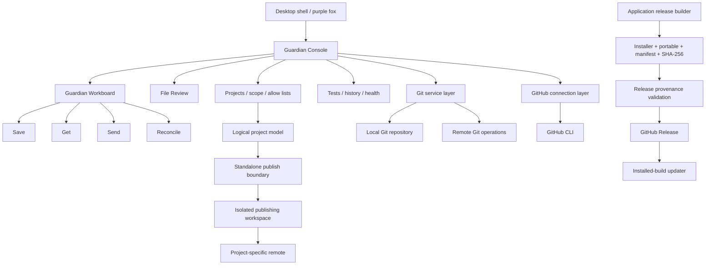

<p align="center">
  
</p>

<h1 align="center">ZomniverseGitPet</h1>

<p align="center"><strong>A desktop Git guardian for human and AI-assisted development.</strong></p>

<p align="center">
  Windows 10 / 11
  &nbsp;•&nbsp;
  .NET 8
  &nbsp;•&nbsp;
  MIT License
</p>

<p align="center">
  <strong>Review what changed → Save locally → Get remote updates → Send saved updates</strong>
</p>

ZomniverseGitPet is a Windows desktop companion that turns Git safety into a visible, low-friction workflow. A small purple fox stays near the workspace while the Guardian Console explains repository state in plain English, reviews changed files, keeps local save points, runs project tests, protects project boundaries, and performs remote Git actions only when the user explicitly requests them.

It is designed for developers, people working with AI coding agents, and anyone who wants Git protection without having to translate every normal action into terminal vocabulary first.

> **Latest stable build:** use the [GitHub Releases](../../releases/latest) page. The Setup EXE is the recommended Windows download.

---

## Current experience

The Guardian workboard separates the four states that matter most during normal development:

| Area | What it means |
| --- | --- |
| **Save — changes on this PC** | Working-tree changes that have not yet been saved as a local Git commit. |
| **Get — waiting to come in** | Remote updates that are known to Git and are not yet present locally. |
| **Send — saved updates** | Local saved history that is ready to be sent to the configured remote. |
| **Reconcile — histories** | Local and remote histories have diverged and need an explicit reconciliation step. |

The toolbar intentionally uses human-first labels:

**GitHub · Projects · Refresh · Review · Tests · Save · Get ↓ · Send ↑ · History · Health**

The underlying operations remain ordinary Git. GitPet adds visibility, previews, confirmations, safety checks, and project-boundary enforcement around them.

---

## File Review

Click a changed file and the Guardian opens a resizable comparison workspace.

| SAVED VERSION | CURRENT VERSION |
| --- | --- |
| Latest local save / Git commit | Current file on disk |
| Human summary by default | Human summary by default |
| Technical source view for normal text files | Technical source view for normal text files |
| Changed baseline lines highlighted | Changed current lines highlighted |

New files clearly show that no saved version existed. Deleted files show that the current version is gone. Binary and very large files are protected from accidental source rendering and can be opened or located instead.

Untracked folders are expanded to individual files so new work can be reviewed file by file rather than as one opaque directory.

---

## Logical projects inside larger repositories

GitPet can treat several named projects as independent logical projects even when they share one physical Git repository.

A logical project can have its own:

- project name;
- selected folder/file scope;
- persistent Advanced Project Allow List;
- test profile;
- remote/publishing destination;
- standalone publishing snapshot.

This is useful for monorepos and large application trees where only part of the parent repository belongs to one publishable project.

### Persistent project allow lists

The Advanced Project Allow List is stored per logical project and restored when that project is reopened. The raw allow-list source and the resolved tree selection are intentionally kept as separate concepts: the list is the project contract, while the tree is its visual representation.

GitPet stores project allow-list state under the user's local application data rather than adding machine-specific configuration to the repository.

---

## Standalone logical-project publishing

A scoped logical project is never published by blindly pushing the parent repository branch.

Instead, GitPet builds an isolated publishing workspace under local application storage:

```text
Parent repository
      │
      ├── logical project scope / allow list
      │
      ▼
%LOCALAPPDATA%\ZomniverseGitPet\Publishing\<projectId>\
      │
      ├── independent Git metadata
      ├── only the selected project files
      └── project-specific remote
      │
      ▼
Standalone online repository
```

The publishing workspace is deliberately outside the source repository. This prevents a logical project from accidentally inheriting and sending the complete parent repository history or unrelated files.

GitPet fingerprints the selected content, not merely the path list, so editing an already-selected file makes the standalone project ready to Send again.

---

## Project / Send boundary check

Before a scoped project can be published, GitPet can compare the saved project allow list with the actual standalone Send snapshot.

The comparison reports:

- **Matched** — expected and prepared for Send;
- **Allow-list only** — expected by the project contract but missing from the Send snapshot;
- **Send only** — prepared for Send but not allowed by the project contract;
- **Allow-list issues** — paths that could not be resolved as expected.

An exact match means the prepared Send snapshot obeys the project boundary. A mismatch blocks standalone Send rather than asking the user to trust a long file list by eye.

The comparison dialog also exposes a read-only command/diagnostic view so advanced users can inspect how the boundary was resolved without performing stage, commit, pull, push, or file-modification operations.

---

## Save, Get, Send and Reconcile

### Save

Save previews the current approved changes, checks Git identity, stages the selected working state, and creates an ordinary **local** Git commit. Saving never sends anything automatically.

Ignored files remain ignored unless the user explicitly approves individual ignored paths for that Save. GitPet can show the ignore source/rule and uses exact-path force-add only for the files the user selected.

### Get ↓

Get is manual and requires a clean working tree. Normal Get uses fast-forward-only safety:

```bash
git pull --ff-only origin <current-branch>
```

GitPet does not create an automatic merge commit during normal Get.

### Send ↑

Send works with already-saved history. Unsaved working-tree changes are not silently included.

For ordinary repositories, Send uses the configured remote branch. For standalone logical-project publishing, the project-boundary preflight must pass before the isolated publishing workspace can be sent.

### Reconcile

If local and remote histories diverge, GitPet separates reconciliation from ordinary Get/Send. It prepares a merge without immediately committing it, surfaces conflicts for explicit file-level decisions, and leaves the final save under user control. Cancel/failure paths abort the prepared merge rather than quietly completing it.

---

## GitHub connection is optional

GitPet supports both:

- **GitHub-connected mode** for GitHub-specific convenience such as authenticated repository lookup/creation and application-release publishing;
- **Local Git Only mode** for repositories that do not need a GitHub account connection.

GitHub authentication is delegated to the official GitHub CLI (`gh`). GitPet does not store a personal-access token.

A local Git repository and an online repository remain separate concepts. GitPet does not silently create or replace an online destination merely because a project is opened.

---

## Repository preparation and hygiene

When an ordinary folder is not already a Git repository, GitPet can prepare it only after the user approves the project scope and repository-hygiene plan.

The initialization command is ordinary Git:

```bash
git init -b main
```

Project preparation does not automatically create an online repository, Save, Get, or Send.

GitPet also provides `.gitignore` guidance, nested-repository protection, exact-path `safe.directory` handling, and a review-first workflow for generated/private-file exclusions.

---

## Tests

Each remembered project can keep its own local test profile. GitPet can suggest likely commands from common project metadata, but discovery is advisory and does not edit project files.

Examples include `npm test`, `dotnet test`, `python -m pytest`, `composer test`, and `cargo test` when corresponding metadata is detected.

Manual test runs execute saved commands in order, stop on the first failure, and show PASS/FAIL output in **Guardian Activity**.

GitPet's own regression suite is a lightweight .NET console test harness covering core Git state, onboarding, logical projects, scope/allow-list behavior, standalone publishing, publish-boundary enforcement, release provenance, update integrity, and other safety rules.

---

## GitPet application releases and updates

GitPet's own application-release pipeline is separate from the projects GitPet manages.

A public Windows release is built with:

```powershell
powershell -ExecutionPolicy Bypass -File scripts/build-release.ps1
```

The release builder:

- requires a clean source tree;
- runs the regression suite;
- creates a self-contained Windows x64 build;
- builds the Inno Setup installer;
- creates a portable executable;
- records the exact source branch and commit;
- writes `release-manifest.json`;
- computes SHA-256 checksums;
- writes package provenance metadata.

GitPet's release publisher verifies the prepared package before creating a GitHub Release. It refuses to publish when the package provenance no longer matches the current source branch/commit, when hashes fail validation, or when the target release already exists.

Installed builds can check GitHub Releases for updates. The updater verifies release metadata and SHA-256 before installing. Development and portable builds are not treated as installed builds for automatic-update purposes.

---

## Current architecture



The local Git repository remains authoritative for normal repository history and working files. GitPet adds a typed local configuration layer, UI state, audit metadata, project-scope information, and isolated publishing state beneath `%LOCALAPPDATA%\ZomniverseGitPet`.

---

## Safety contract

| GitPet may do after the appropriate user action | GitPet does not do silently |
| --- | --- |
| Read repository status/history | Push/Send commits automatically |
| Review saved/current files | Pull/Get remote changes automatically |
| Create confirmed local saves | Force-push `main` |
| Run configured project tests | Replace an existing remote without approval |
| Add an explicitly approved remote | Use destructive `reset --hard` / `clean` workflows as normal app behavior |
| Add an exact approved `safe.directory` path | Use `safe.directory=*` |
| Prepare explicit reconciliation | Commit a reconciliation without the user's final Save |
| Publish an explicitly scoped standalone project | Publish files outside a failed project-boundary check |

Automatic verified saving is **off by default**, creates local saves only, and never triggers Get or Send.

---

## Development workflow

Requirements for building from source:

- Windows;
- .NET 8 SDK;
- Git for Windows;
- Inno Setup for full installer/release packaging.

Build and run the regression suite:

```powershell
dotnet build ZomniverseGitPet.sln -c Release
dotnet run --project tests/ZomniverseGitPet.Tests/ZomniverseGitPet.Tests.csproj -c Release
```

For the fast local DEV loop:

```powershell
powershell -ExecutionPolicy Bypass -File scripts/publish-local.ps1
```

The DEV publisher writes the runnable development executable outside the source repository under:

```text
%LOCALAPPDATA%\ZomniverseGitPet\DEV\DEV-ZomniverseGitPet.exe
```

and maintains the `DEV-ZGitPet` Start Menu shortcut.

For a public installer/portable package, use `scripts/build-release.ps1` instead of the DEV publisher.

---

## Major updates and project milestones

GitPet's **Major update? ✦** feature is for the history of a project being managed by GitPet. It is separate from GitPet's own application-release versioning.

The milestone flow can preserve an earlier generation as an ordinary legacy branch and annotated tag while redesign work continues separately. It does not rewrite the main branch, reset working files, or publish a release automatically.

See [Major updates, milestones, and releases](docs/MAJOR_UPDATES_AND_RELEASES.md) for the detailed model.

---

## Documentation

The repository is being organized into canonical user, developer, safety, reference, and architecture-decision documentation. Until that documentation center is complete, the source code and regression tests remain authoritative for implementation behavior.

The historical PowerShell proof of concept remains under `prototype/powershell/` for reference. Its internals and configuration model are not the architecture of the maintained C# application.

---

## License

ZomniverseGitPet is available under the [MIT License](LICENSE).
