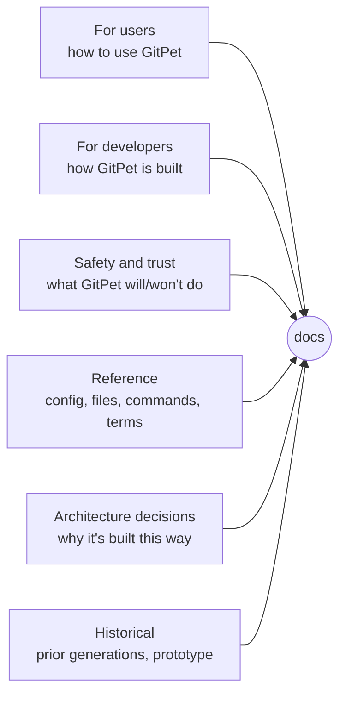

# ZomniverseGitPet documentation

This is the canonical documentation index for ZomniverseGitPet ("GitPet"), a Windows desktop companion that turns everyday Git safety into a visible workflow: Review, Save, Get, Send, and Reconcile.

For the project pitch and screenshots, see the [root README](../README.md). This page is the map for everything else.

> These canonical docs describe behavior shipped in the current stable GitPet application. Active source development may happen on other branches, but users should not need to switch branches to find the stable documentation. For the latest public build, use [GitHub Releases](../../releases/latest).

## For users

| Document | What it covers |
| --- | --- |
| [Getting Started](user/GETTING_STARTED.md) | First run, choosing GitHub-connected or Local Git Only mode, opening or cloning a project. |
| [Projects](user/PROJECTS.md) | Opening an existing folder, preparing a new one, and choosing what belongs to a project. |
| [Save, Get, Send](user/SAVE_GET_SEND.md) | The core Review → Save → Get → Send loop and what each verb actually does in Git terms. |
| [Reconciliation](user/RECONCILIATION.md) | What happens when local and remote history diverge, and how to resolve it. |
| [GitHub Connection](user/GITHUB_CONNECTION.md) | Connecting, signing in, creating or finding a GitHub repository, and Local Git Only mode. |
| [Logical Projects](user/LOGICAL_PROJECTS.md) | Running more than one named GitPet project out of a single Git repository. |
| [Advanced Project Allow Lists](user/ALLOW_LISTS.md) | The persisted, per-project file list that GitPet checks before it will Send a logical project. |
| [Releases and Updates](user/RELEASES_AND_UPDATES.md) | How GitPet checks for and installs its own updates, and where to get the latest release. |
| [Troubleshooting](user/TROUBLESHOOTING.md) | Known failure modes (dubious ownership, diverged branches, missing GitHub CLI, blocked Send) and what to do about them. |

## For developers

| Document | What it covers |
| --- | --- |
| [Architecture](developer/ARCHITECTURE.md) | High-level map of the desktop shell, Guardian, Git service, GitHub layer, and publishing/update subsystems. |
| [Application Lifecycle](developer/APPLICATION_LIFECYCLE.md) | Startup sequence, single-instance enforcement, DEV vs. installed detection. |
| [Project Model](developer/PROJECT_MODEL.md) | How a "logical project" is represented, scoped, and persisted. |
| [Git Integration](developer/GIT_INTEGRATION.md) | The `GitService` process layer, `.gitignore` handling, and safe-directory (dubious ownership) support. |
| [GitHub Integration](developer/GITHUB_INTEGRATION.md) | GitHub CLI-based authentication, repository creation/discovery, and connection flows. |
| [Publishing Architecture](developer/PUBLISHING_ARCHITECTURE.md) | Standalone logical-project publishing, the isolated workspace, and content fingerprinting. |
| [Update System](developer/UPDATE_SYSTEM.md) | GitPet's own self-update mechanism, separate from the user-project "Major Update" feature. |
| [UI Architecture](developer/UI_ARCHITECTURE.md) | WinForms shell conventions: theme, window chrome, custom controls, the Guardian workboard. |
| [Testing](developer/TESTING.md) | The project's bespoke regression-test architecture and how to run it. |
| [Build and Release](developer/BUILD_AND_RELEASE.md) | `build-release.ps1`, the installer, release manifests, and provenance validation. |

## Safety and trust

| Document | What it covers |
| --- | --- |
| [Safety Model](safety/SAFETY_MODEL.md) | What GitPet does automatically, what it always asks for, and what it refuses to do. |
| [Project Boundaries](safety/PROJECT_BOUNDARIES.md) | How the Advanced Project Allow List acts as a publishing contract for a logical project. |
| [Send Preflight](safety/SEND_PREFLIGHT.md) | Every check GitPet runs before a Save or a Send is allowed to proceed. |
| [Reconciliation Safety](safety/RECONCILIATION_SAFETY.md) | Why reconciliation never creates a silent merge commit, and how a failed reconciliation is undone. |
| [Filesystem and Sandbox](safety/FILESYSTEM_AND_SANDBOX.md) | Dubious-ownership handling, isolated publishing workspaces, and cloud-synced-folder considerations. |

## Reference

| Document | What it covers |
| --- | --- |
| [Configuration](reference/CONFIGURATION.md) | Every field in GitPet's own settings file. |
| [AppData Layout](reference/APPDATA_LAYOUT.md) | Every file GitPet keeps under `%LOCALAPPDATA%\ZomniverseGitPet`. |
| [Commands](reference/COMMANDS.md) | The exact Git commands GitPet runs, and when. |
| [File Formats](reference/FILE_FORMATS.md) | JSON schemas for the release manifest, allow-list store, and other persisted files. |
| [Terminology](reference/TERMINOLOGY.md) | GitPet's vocabulary mapped to the underlying Git concepts. |

## Architecture decisions

See the [ADR index](adr/README.md) for the full list. These records capture *why* GitPet is built the way it is, not how to use it.

## Historical documentation

| Document | What it covers |
| --- | --- |
| [Release History](history/RELEASE_HISTORY.md) | Version-by-version changelog record, including known gaps. |
| [Major Updates and Releases](history/MAJOR_UPDATES_AND_RELEASES.md) | The Milestones / legacy-branch feature for a user's own project history (moved here from the repository root `docs/` folder). |

The original PowerShell prototype (`prototype/powershell/`) is a superseded proof of concept, not part of this documentation tree; see its own `README.md` for context. Maintainer-only audit material lives under `docs/internal/` and is not part of the public reading path.

---

*Documentation drift check: this index should be updated whenever a canonical document is added or retired — see [`DOCUMENTATION_MAINTAINER.md`](DOCUMENTATION_MAINTAINER.md).*