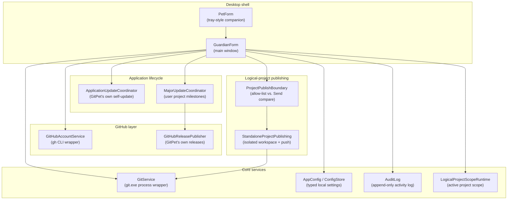

# Architecture

GitPet is a single-process Windows Forms application (`net8.0-windows`, WinForms, `src/ZomniverseGitPet/`). There is no service, no daemon, no network server of its own — everything runs inside one desktop process, shelling out to `git.exe` and `gh.exe` (GitHub CLI) as needed.

## The layers, briefly

- **Desktop shell** — `PetForm` is the always-present companion; `GuardianForm` is the main working window, created on demand. `ZomniverseGitPetContext` (an `ApplicationContext`) owns their lifecycle and a background poll timer for silent "automatic checkpoint" saves.
- **Core services** — `GitService` is the single place that shells out to `git.exe`; `AppConfig`/`ConfigStore` is GitPet's own typed JSON settings; `AuditLog` is an append-only JSONL activity trail; `LogicalProjectScopeRuntime` resolves "what does the *active* project's scope include" for everything else to query.
- **GitHub layer** — `GitHubAccountService` wraps the GitHub CLI for auth/repo-creation/discovery; `GitHubReleasePublisher` is unrelated maintainer tooling for publishing new *GitPet* versions (see [Update System](UPDATE_SYSTEM.md)).
- **Logical-project publishing** — `ProjectPublishBoundary` compares a project's saved allow list against what would actually be sent; `StandaloneProjectPublishing` builds and pushes the isolated workspace. See [Publishing Architecture](PUBLISHING_ARCHITECTURE.md).
- **Lifecycle features** — `ApplicationUpdateCoordinator` is GitPet checking for and installing *its own* new versions; `MajorUpdateCoordinator` is an unrelated, advisory feature that looks at the *user's own project* for signs of a big redesign. These two are easy to conflate and are not the same system — see [Update System](UPDATE_SYSTEM.md).

## Where to go next

| Question | Document |
| --- | --- |
| How does GitPet start up, and what's DEV vs. installed? | [Application Lifecycle](APPLICATION_LIFECYCLE.md) |
| How is a "project" modeled and persisted? | [Project Model](PROJECT_MODEL.md) |
| How does GitPet actually run Git commands, and handle `.gitignore`? | [Git Integration](GIT_INTEGRATION.md) |
| How does GitHub auth/repo-creation work? | [GitHub Integration](GITHUB_INTEGRATION.md) |
| How does a scoped logical project get published on its own? | [Publishing Architecture](PUBLISHING_ARCHITECTURE.md) |
| How does GitPet update itself? | [Update System](UPDATE_SYSTEM.md) |
| How is the UI built (theme, controls, workboard)? | [UI Architecture](UI_ARCHITECTURE.md) |
| How is this all tested? | [Testing](TESTING.md) |
| How is a release built and published? | [Build and Release](BUILD_AND_RELEASE.md) |
