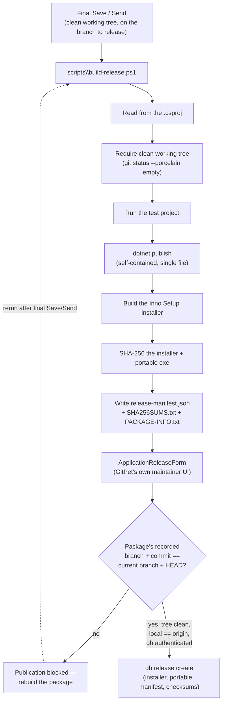

# Build and release

Source: `scripts/build-release.ps1`, `scripts/publish-local.ps1`, `installer/ZomniverseGitPet.iss`, `ApplicationReleaseForm.cs`, `GitHubReleasePublisher.cs`.

## The DEV loop: `publish-local.ps1`

Fast, unversioned, no test run, no clean-tree check:

1. `dotnet publish` (`-r win-x64 --self-contained true -p:PublishSingleFile=true`, Release).
2. Copies the result to `%LOCALAPPDATA%\ZomniverseGitPet\DEV\DEV-ZomniverseGitPet.exe` — the `DEV-` prefix is what [DEV-build detection](APPLICATION_LIFECYCLE.md#dev-vs-installed-vs-portable) looks for.
3. Refreshes a `DEV-ZGitPet.lnk` Start Menu shortcut.
4. Removes older, now-legacy DEV artifact locations from prior versions of this script.

This script never touches the installer or the release-manifest pipeline below.

## The release pipeline: `build-release.ps1` → installer → publish



1. **`build-release.ps1`** reads the version from the `.csproj` (the single source of truth for the version number), records the current Git branch and commit, and **aborts if the working tree isn't clean**. It then builds, runs the test project (skippable only with `-SkipTests`, never for a real release), publishes a self-contained single-file build, invokes the Inno Setup installer (`installer/ZomniverseGitPet.iss`), computes SHA-256 hashes for both the installer and the portable executable, and writes `release-manifest.json`, `SHA256SUMS.txt`, and `PACKAGE-INFO.txt` into a versioned output folder outside the repository. There is no code-signing step.
2. **`installer/ZomniverseGitPet.iss`** installs per-user under `%LOCALAPPDATA%\Programs\...` (no admin rights required), targets x64 only, uses a fixed `AppId` GUID so upgrades install over a previous version, and requires no separate .NET runtime install (consistent with a self-contained publish).
3. **`ApplicationReleaseForm`** (GitPet's own maintainer-only UI, visible only when the open project is the GitPet source tree itself) inspects the package `build-release.ps1` produced and only enables publishing once *all* of the following hold:
   - the package's recorded source branch and commit exactly match the currently checked-out branch and HEAD commit (**provenance validation** — a package built from an older commit is rejected with an explicit message telling you to rebuild it),
   - the working tree is clean,
   - local history and `origin` are exactly aligned (nothing unsent, nothing unreceived),
   - the GitHub CLI is authenticated.
4. Publishing runs `gh release create <tag> <installer> <portable> <manifest> <checksums> ...` — GitPet first checks that a release for that tag doesn't already exist and refuses to overwrite one. **Existing GitHub Releases are never replaced**, and no branch is ever force-pushed as part of this flow.

See [ADR-0005](../adr/ADR-0005-APPLICATION-RELEASE-PROVENANCE.md) for why publication is blocked on provenance mismatch rather than trusting the manifest alone.

## Plain manual build

```powershell
dotnet build ZomniverseGitPet.sln -c Release
dotnet publish src/ZomniverseGitPet/ZomniverseGitPet.csproj -c Release -r win-x64 --self-contained true -p:PublishSingleFile=true
```
