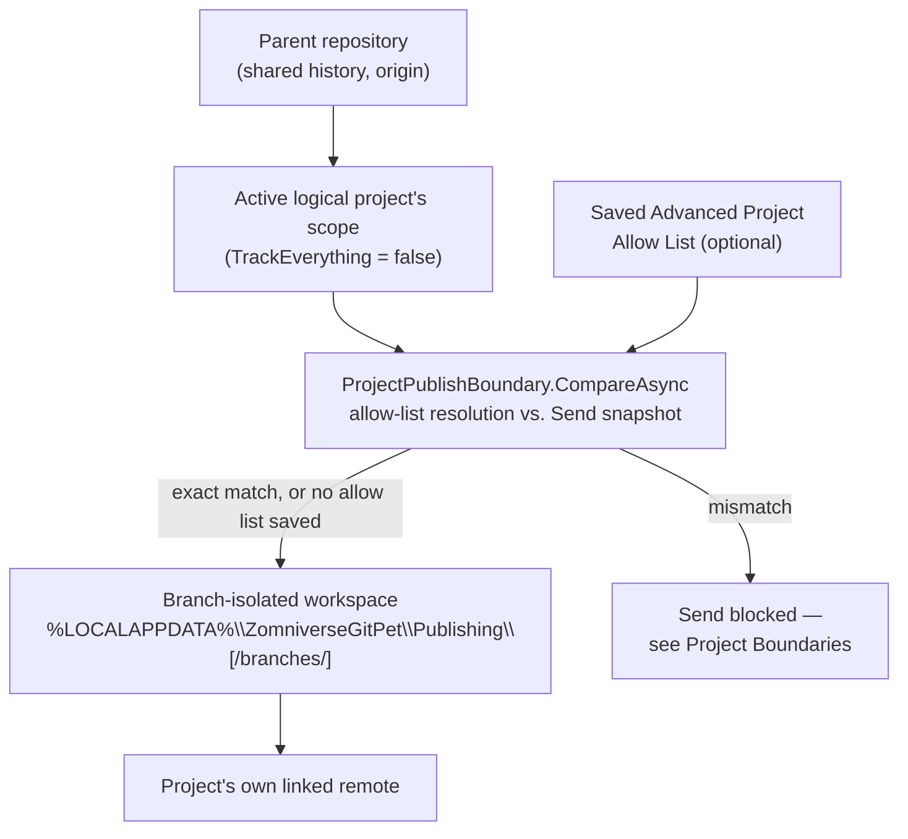

# Publishing architecture

Source: `StandaloneProjectPublishing.cs`, `StandaloneProjectPublishingUiRuntime.cs`, `ProjectPublishBoundary.cs`, `ProjectPublishBoundaryDialog.cs`, `ProjectAllowListStore.cs`, `ProjectScopeAllowList.cs`.

This is how a [logical project](../user/LOGICAL_PROJECTS.md) — a named scope smaller than its parent repository — gets sent somewhere without ever touching the parent repository's shared history or its `origin` remote.



## The isolated workspace

`StandaloneProjectPublishing` builds a **separate, on-disk Git working copy** per logical project, at:

```
%LOCALAPPDATA%\ZomniverseGitPet\Publishing\<sanitized-project-id>\
```

This path is verified (and regression-tested) to never be a subdirectory of the source repository. The workspace has its own `.git`, its own `origin` (the project's own linked remote — not the parent repository's), and only ever contains the files inside the active project's scope.

The historical `main` workspace stays at `Publishing\<projectId>\` for compatibility. Non-main standalone branches use a deterministic branch-specific subdirectory beneath `Publishing\<projectId>\branches\`, so switching between `main` and `feature/*` cannot reuse the wrong isolated HEAD/history.

## Publish flow

1. Requires an active logical (scoped) project, a linked remote, and a **clean** working tree in the *source* repository.
2. Builds a content-based snapshot: `git ls-tree -r --full-tree HEAD -- <pathspecs>` at the source repository's `HEAD`, fingerprinted as `SHA256(sorted pathspecs + raw ls-tree output)`. Because this includes blob identities, editing a file at the same path (no rename) still changes the fingerprint — an in-place edit is never treated as "nothing to send."
3. If the fingerprint already matches the last published one, the publish is a no-op ("already published").
4. The workspace is wiped (except `.git`) and repopulated with exactly the scoped files copied from the source repository.
5. `git init -b main` if the workspace has no history yet; the source repository's `user.name`/`user.email` are copied in (fails explicitly if unset); `origin` is set to the linked remote.
6. `git add -f -A` (force, to override any ignore rules inherited by the copy), commits only if there's an actual diff, with message `publish: {ProjectDisplayName} from {shortSourceCommit}`.
7. Push the isolated `HEAD` explicitly to the selected remote branch: `git push -u origin HEAD:refs/heads/<selected-standalone-branch>`.
8. On success, the fingerprint and source commit are recorded **for that standalone branch**, so switching branches cannot reuse another branch's baseline; an audit-log entry (`standalone_project_published`) is written.

## Standalone Get / receive flow

Scoped Get is deliberately **not** implemented as `git pull` in the parent repository, because the standalone project and parent repository have intentionally separate histories.

1. Require a linked standalone project remote and a clean scoped working tree.
2. Refuse Get when saved local project updates are still waiting to be sent (unless the project has no publishing baseline yet).
3. Use the isolated publishing workspace as the remote-history boundary.
4. Fetch the selected standalone branch only inside that branch's isolated workspace.
5. Diff the isolated workspace baseline against `refs/remotes/origin/<selected-standalone-branch>`.
6. Validate every added, modified, deleted, copied, or renamed path against the active logical project's configured scope.
7. Block the entire receive operation if any changed path escapes the project scope.
8. Materialize the remote project snapshot inside the isolated workspace.
9. Copy only the validated changed files back into the parent working tree; apply validated deletions only inside scope.
10. Leave the imported files **uncommitted** in the parent repository so Guardian can show them in Save/File Review before the user chooses to Save.

The parent repository's `origin`, branch history, and unrelated sibling files are never pulled or rewritten by standalone Get.

If both a local standalone snapshot is waiting to Send and the standalone remote has incoming changes, GitPet disables both directions and surfaces the state rather than automatically reconciling independent histories.

## Compare with Send / the publish boundary

Before any of the above runs, if the active project has a saved [allow list](../user/ALLOW_LISTS.md), `ProjectPublishBoundary.CompareAsync` resolves that allow list against the repository's committed tree and diffs it against the same snapshot step 2 would build, producing three buckets: **matched**, **allow-list only** (in the contract, not in what would be sent), and **send only** (about to be sent, not in the contract). Only an exact match (empty allow-list-only and send-only sets, no resolution issues) is allowed to proceed automatically; anything else blocks the publish and shows the mismatch. See [Project Boundaries](../safety/PROJECT_BOUNDARIES.md) for the full safety mechanism and [ADR-0004](../adr/ADR-0004-PROJECT-ALLOW-LIST-PUBLISH-BOUNDARY.md) for why this exists at all.

## UI wiring

`StandaloneProjectPublishingUiRuntime` polls every 650ms and, whenever the active project is a scoped logical project, replaces the ordinary Get/Send actions with scoped Get/Send actions and exposes a **Branch ▾** selector. The selector lists existing heads from the standalone remote and is disabled while local/outgoing/incoming/reconciliation state is unresolved. Selecting a standalone branch never runs `checkout` or `switch` in the parent repository. A whole-repository project never sees these substitutions.

See [ADR-0003](../adr/ADR-0003-STANDALONE-LOGICAL-PROJECT-PUBLISHING.md) for why an isolated workspace was chosen over `git subtree`/sparse-checkout/filter-branch.
