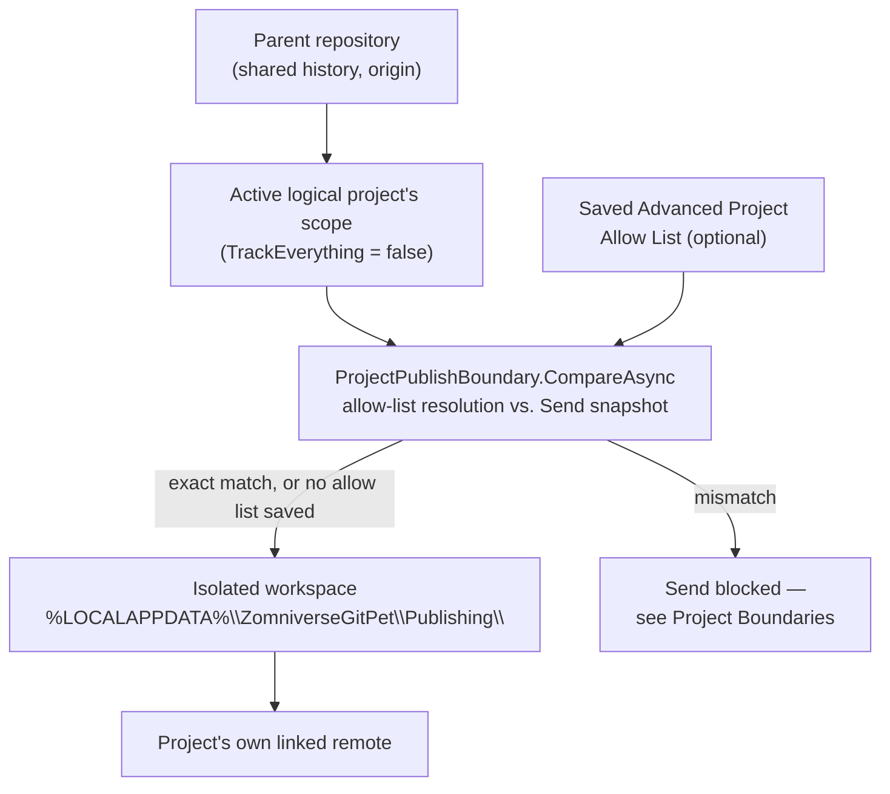

# Publishing architecture

Source: `StandaloneProjectPublishing.cs`, `StandaloneProjectPublishingUiRuntime.cs`, `ProjectPublishBoundary.cs`, `ProjectPublishBoundaryDialog.cs`, `ProjectAllowListStore.cs`, `ProjectScopeAllowList.cs`.

This is how a [logical project](../user/LOGICAL_PROJECTS.md) — a named scope smaller than its parent repository — gets sent somewhere without ever touching the parent repository's shared history or its `origin` remote.



## The isolated workspace

`StandaloneProjectPublishing` builds a **separate, on-disk Git working copy** per logical project, at:

```
%LOCALAPPDATA%\ZomniverseGitPet\Publishing\<sanitized-project-id>\
```

This path is verified (and regression-tested) to never be a subdirectory of the source repository. The workspace has its own `.git`, its own `origin` (the project's own linked remote — not the parent repository's), and only ever contains the files inside the active project's scope.

## Publish flow

1. Requires an active logical (scoped) project, a linked remote, and a **clean** working tree in the *source* repository.
2. Builds a content-based snapshot: `git ls-tree -r --full-tree HEAD -- <pathspecs>` at the source repository's `HEAD`, fingerprinted as `SHA256(sorted pathspecs + raw ls-tree output)`. Because this includes blob identities, editing a file at the same path (no rename) still changes the fingerprint — an in-place edit is never treated as "nothing to send."
3. If the fingerprint already matches the last published one, the publish is a no-op ("already published").
4. The workspace is wiped (except `.git`) and repopulated with exactly the scoped files copied from the source repository.
5. `git init -b main` if the workspace has no history yet; the source repository's `user.name`/`user.email` are copied in (fails explicitly if unset); `origin` is set to the linked remote.
6. `git add -f -A` (force, to override any ignore rules inherited by the copy), commits only if there's an actual diff, with message `publish: {ProjectDisplayName} from {shortSourceCommit}`.
7. `git push -u origin main`.
8. On success, the fingerprint and source commit are recorded so step 3 can short-circuit next time, and an audit-log entry (`standalone_project_published`) is written.

## Compare with Send / the publish boundary

Before any of the above runs, if the active project has a saved [allow list](../user/ALLOW_LISTS.md), `ProjectPublishBoundary.CompareAsync` resolves that allow list against the repository's committed tree and diffs it against the same snapshot step 2 would build, producing three buckets: **matched**, **allow-list only** (in the contract, not in what would be sent), and **send only** (about to be sent, not in the contract). Only an exact match (empty allow-list-only and send-only sets, no resolution issues) is allowed to proceed automatically; anything else blocks the publish and shows the mismatch. See [Project Boundaries](../safety/PROJECT_BOUNDARIES.md) for the full safety mechanism and [ADR-0004](../adr/ADR-0004-PROJECT-ALLOW-LIST-PUBLISH-BOUNDARY.md) for why this exists at all.

## UI wiring

`StandaloneProjectPublishingUiRuntime` polls every 650ms and, whenever the active project is a scoped logical project, replaces the ordinary "Send" button with a "Send ↑" button routed through this whole flow instead of the parent repository's plain push. A whole-repository project never sees this substitution.

See [ADR-0003](../adr/ADR-0003-STANDALONE-LOGICAL-PROJECT-PUBLISHING.md) for why an isolated workspace was chosen over `git subtree`/sparse-checkout/filter-branch.
