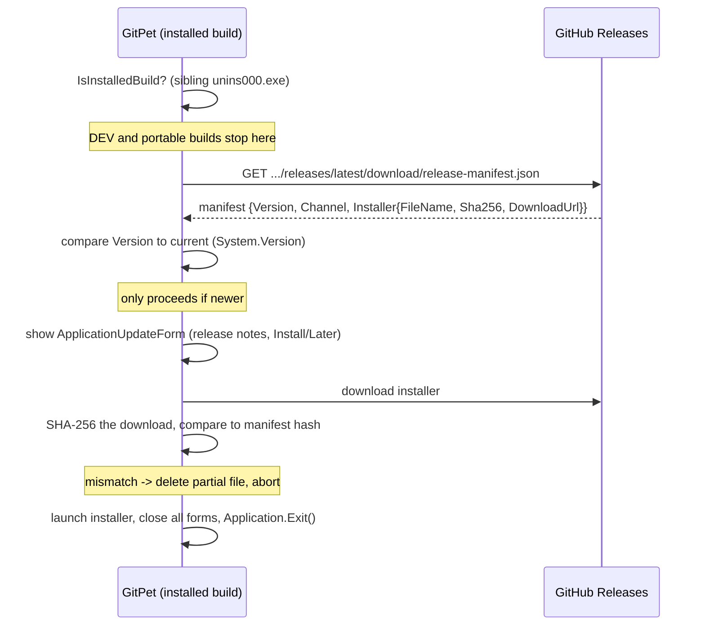

# Update system

There are **two unrelated features** in this codebase that both involve version numbers, branches, tags, and GitHub Releases. Keeping them separate is the single easiest documentation mistake to make here.

| | `ApplicationUpdateCoordinator` / `Service` / `Form` | `MajorUpdateCoordinator` / `Feature` / `Form` |
| --- | --- | --- |
| Subject | **GitPet's own** version | The **user's own project's** history |
| Question it answers | "Is there a newer GitPet available?" | "Does this project's history look like it's entering a big new generation?" |
| Action | Downloads and installs a new GitPet build | Creates local legacy branch + tag before a redesign |
| Publishes a GitHub Release? | No (consumes one) | No — see `ApplicationReleaseFeature` below for what actually publishes one |

## GitPet's self-update (`ApplicationUpdateCoordinator`/`Service`/`Form`)

Source: `ApplicationUpdateCoordinator.cs`, `ApplicationUpdateService.cs`, `ApplicationUpdateForm.cs`.

- Runs only for installed builds (`IsInstalledBuild`: a sibling `unins000.exe` exists). DEV and portable builds never self-update.
- First check 20 seconds after launch, then every 6 hours.
- The manifest URL is fixed: a `release-manifest.json` asset attached to the latest GitHub Release of this repository. `Channel` must be `"stable"`.
- The installer download is resumable-safe (an already-verified file is reused) and written to a `.download` temp file, renamed only after its hash matches.

See [ADR-0006](../adr/ADR-0006-INSTALLED-ONLY-SELF-UPDATE.md).

## The user's project "Major Update" / Milestones (`MajorUpdateCoordinator`/`Feature`/`Form`)

Source: `MajorUpdateCoordinator.cs`, `MajorUpdateFeature.cs`, `MajorUpdateForm.cs`.

A heuristic advisor that inspects the currently open project (file/line churn, dependency/schema-file changes, format migrations) and, only with explicit user approval, can create a **local** legacy branch and annotated tag preserving the current generation before continuing on a new branch. It never rewrites history, resets, or cleans the working tree, and pushing the resulting legacy refs is a separate, explicit step. See [`docs/history/MAJOR_UPDATES_AND_RELEASES.md`](../history/MAJOR_UPDATES_AND_RELEASES.md) for the full model.

## Publishing an actual GitPet release (`ApplicationReleaseFeature`/`Form`)

This is the third, still-different piece: the maintainer-only tool that actually uploads a new GitPet version to GitHub Releases. It's visible only when the currently open project *is* the GitPet source repository itself, and it's covered in [Build and Release](BUILD_AND_RELEASE.md) since it's part of the release pipeline, not the update system.
