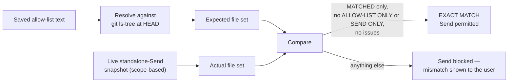

# Project boundaries

How GitPet stops a [logical project](../user/LOGICAL_PROJECTS.md) from accidentally sending more (or less) than you intended — either the rest of a shared parent repository, or files you meant to exclude.

## The allow list as a publishing contract

A saved [Advanced Project Allow List](../user/ALLOW_LISTS.md) is treated as the project's **contract**: "these are the files this project is supposed to publish." It's optional — if a project never has one saved, this check doesn't run for it.

## What gets compared

`ProjectPublishBoundary.CompareAsync` (`ProjectPublishBoundary.cs`) does two independent resolutions and diffs them:

1. **Expected** — resolves the saved allow-list text (`ProjectScopeAllowList.Resolve`) into paths, then runs `git ls-tree -r --full-tree --name-only HEAD -- <pathspecs>` to get what those paths *actually* resolve to at the last saved commit — i.e. real leaf files, not folder names.
2. **Actual** — the same snapshot [standalone publishing](../developer/PUBLISHING_ARCHITECTURE.md) would send.

The diff produces three buckets, plus an issues list:

| Bucket | Meaning |
| --- | --- |
| **MATCHED** | In both — fine. |
| **ALLOW-LIST ONLY** | The contract expects it, but it wouldn't be sent (e.g. deleted, or excluded from scope). |
| **SEND ONLY** | About to be sent, but the contract never mentioned it — the most important bucket, since this is exactly the "scope leaked" case this mechanism exists to catch. |
| **ALLOW-LIST ISSUES** | Lines in the allow list that didn't resolve cleanly (outside the root, inside `.git`, inside a nested repository, or don't exist). |

**Exact match** requires: no issues, an empty ALLOW-LIST ONLY set, and an empty SEND ONLY set. Anything else is a mismatch.

## Automatic Send blocking

`StandaloneProjectPublishingUiRuntime.PublishAsync` runs this comparison before every standalone publish. If an allow list is saved and the comparison isn't an exact match, the actual publish call is never reached — the user only ever sees the mismatch dialog (`ProjectPublishBoundaryDialog`, opened in "publishing gate" mode). If no allow list was ever saved for the project, this gate is simply skipped.

## Read-only inspection ("Compare with Send")

The same comparison is also available on demand, outside of a Send attempt, via a **"Compare with Send ↑"** button (injected into the scope-selection UI by `ProjectAllowListUiBridge`). `ProjectPublishBoundaryDialog` presents:

- the pass/fail report (MATCHED / ALLOW-LIST ONLY / SEND ONLY / ALLOW-LIST ISSUES, and the overall exact-match state),
- a **copyable** plain-text version of that report,
- a raw **command/diagnostic log** — the exact `git ls-tree` commands used, explicitly labeled as read-only ("these commands only read the saved HEAD tree; they do not stage, commit, pull, push, or modify files"),
- an option to open a PowerShell window with those exact diagnostic commands pre-seeded on the clipboard, for manual inspection outside GitPet.

See [ADR-0004](../adr/ADR-0004-PROJECT-ALLOW-LIST-PUBLISH-BOUNDARY.md) for why this exists as a separate, explicit contract rather than trusting the live scope selection alone.
