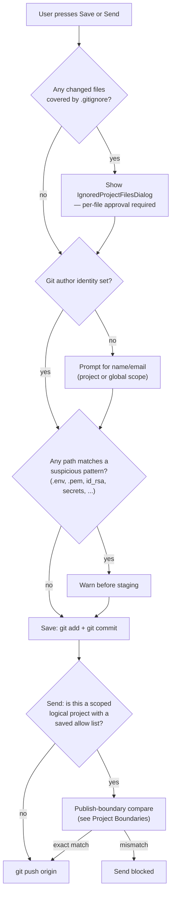

# Send preflight

Every check GitPet runs *before* it will let a Save or a Send proceed, in one place.

## Save preflight

1. **Ignored-file check** — `git check-ignore -v` is run against every changed path; anything covered by a `.gitignore` rule (root, nested, or `.git/info/exclude`) is shown to the user with its exact rule and source file/line, and is force-tracked only if explicitly ticked. This step never stages anything itself — it only computes what *would* be staged for the dialog to show.
2. **Author identity** — Save refuses to create a commit without a configured `user.name`/`user.email`; GitPet prompts for one (project-scoped or global) rather than letting Git fail with an opaque error.
3. **Suspicious-path check** — changed paths are checked against a configurable list of secret-like patterns (`.env`, `.pem`, `.key`, `id_rsa`, `credentials`, `secrets`, `password`, `token`, and similar) and flagged before staging, though this is a warning, not a hard block.

## Send preflight

1. Send only ever operates on **already-saved** commits — never anything currently unsaved on disk.
2. If the active project is a scoped [logical project](../user/LOGICAL_PROJECTS.md) with a saved [allow list](../user/ALLOW_LISTS.md), the [publish-boundary comparison](PROJECT_BOUNDARIES.md) runs first. An **unexpected SEND ONLY file** — something about to be sent that the saved allow list never mentioned — is treated as a publishing safety violation and blocks the Send outright, with the mismatch shown to the user rather than silently proceeding.
3. Only once these checks pass does GitPet run the actual `git push`.

This two-stage preflight (Save-time ignored-file gate, Send-time boundary gate) exists specifically to prevent a scoped project's data — whether an accidentally-tracked secret or a scope that quietly grew — from leaking further than intended.
