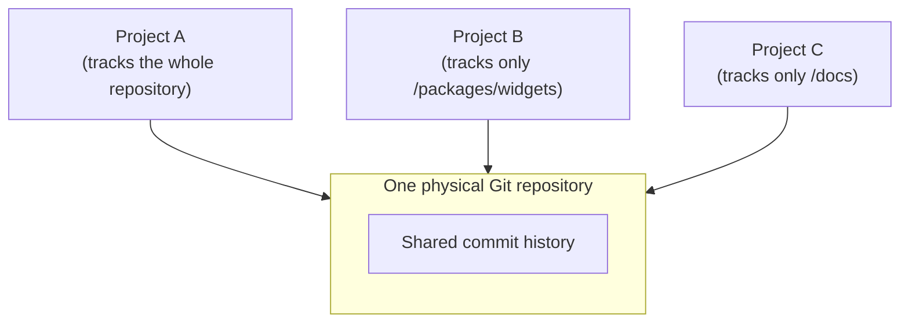

# Logical projects

Normally, one Git repository is one project. GitPet also supports the opposite: **several named GitPet projects living inside one physical Git repository**, each tracking its own slice of the folder tree.

## Why this exists

A single folder on disk sometimes contains more than one thing you want to think of and publish separately — a shared monorepo where you only care about one package, or a personal workspace where a subfolder is really its own small tool. Rather than requiring a separate Git repository (and separate history) for each, GitPet lets you register several named projects against the same repository, each with its own scope.

## How scope works

Each logical project is either:

- **Whole-repository** — tracks everything, the ordinary case, or
- **Scoped** — tracks only the files and folders you explicitly selected, via the project-scope tree or a pasted [Advanced Project Allow List](ALLOW_LISTS.md).

A project's scope does not have to be a single subfolder — it can be an arbitrary, scattered set of files and folders anywhere under the repository root.

## What stays independent between projects

- Display name
- Scope (which files/folders belong to it)
- Its own saved test commands
- Its own [Advanced Project Allow List](ALLOW_LISTS.md), if you save one
- Its own standalone-publishing link, if you set one up (see [Publishing Architecture](../developer/PUBLISHING_ARCHITECTURE.md))

What's shared: the underlying Git commit history, working tree, and `origin` remote (unless a project publishes standalone — below).

## Sending a scoped project

A whole-repository project sends with the ordinary Send button, pushing all of `origin`'s history. A scoped logical project instead uses **standalone publishing**: GitPet builds an isolated copy containing only that project's files and pushes it to its own linked remote, so a scoped project can never accidentally push the rest of the parent repository. See [Publishing Architecture](../developer/PUBLISHING_ARCHITECTURE.md) and [Project Boundaries](../safety/PROJECT_BOUNDARIES.md) for exactly how that isolation works and how GitPet checks it before every Send.
