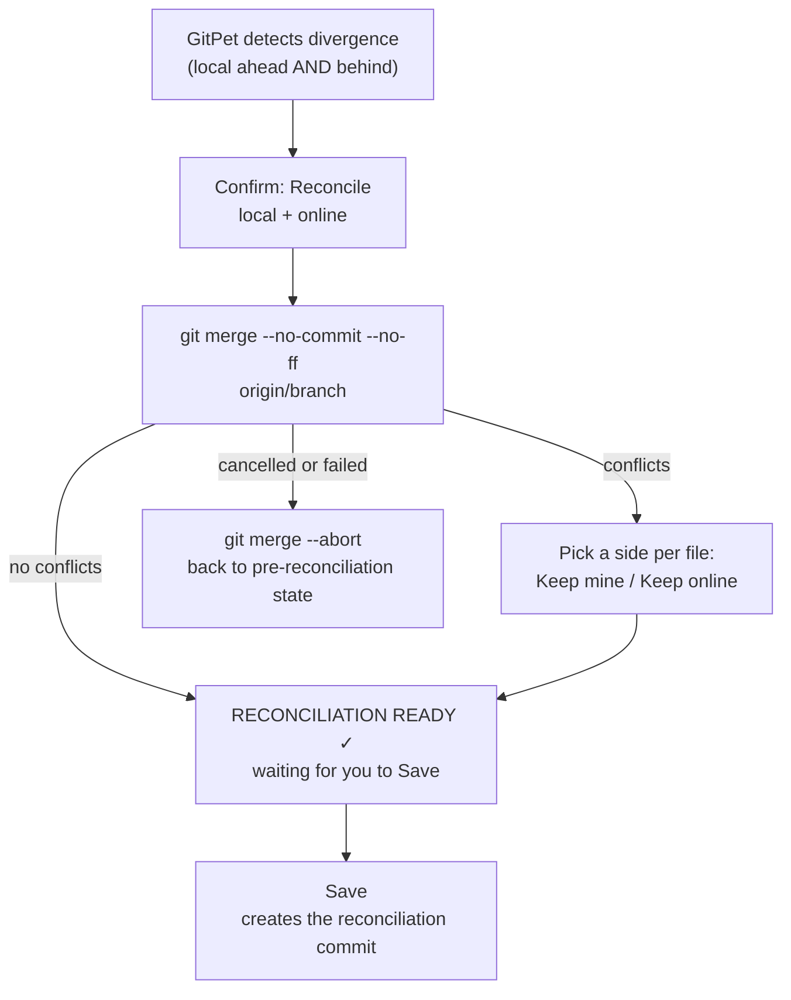

# Reconciliation

Reconciliation is what happens when your local history and the remote's history have both moved forward independently — you have saved commits the remote doesn't have, and the remote has commits you don't have. GitPet calls this **diverged**, and it refuses to guess how to combine the two on its own.

## How it starts

GitPet checks for divergence by fetching from the remote in the background (at least every 10 seconds) and comparing ahead/behind counts. When both are non-zero, the Get button becomes **Reconcile ↕** instead.

## Resolving conflicts

If the same lines changed on both sides, GitPet shows a grid, one row per conflicting file, and asks you to pick **Keep my local version** or **Keep online version** for each one — there's no partial/manual line-merge editor. If either side actually deleted the file, that's offered as one of the choices too.

## Finishing

Once there are no more conflicts (or there never were any), GitPet doesn't finish for you — it waits for you to press **Save**, which is what actually creates the reconciliation commit locally. Nothing is sent anywhere until you separately choose **Send**. If you cancel at any point during reconciliation, GitPet aborts the in-progress merge and puts the repository back exactly as it was.

## Why it works this way

- Reconciliation never happens silently — it's always something you start and something you finish with an explicit Save.
- There's no automatic "resolve conflicts for me" — every conflicting file gets a deliberate, individual choice.
- Cancelling is always safe: nothing is left half-merged.

See [Reconciliation Safety](../safety/RECONCILIATION_SAFETY.md) for the exact guarantees.
