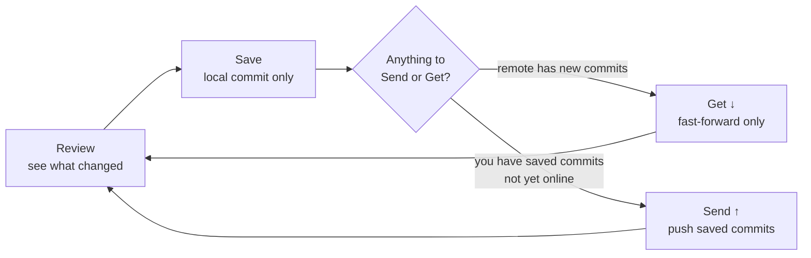

# Save, Get, Send

This is the loop you'll use for almost everything: look at what changed, save it locally, bring down anyone else's work, and send your saved work out. GitPet deliberately keeps these as separate, explicit steps — nothing here happens automatically unless you've turned on automatic Saving (still local-only; see below).



## Review

Click any changed file and the lower Guardian area becomes a side-by-side comparison: the **saved** version (your last local commit) versus the **current** version (what's on disk now). A Human summary explains what happened in plain language; a Technical view shows the actual highlighted diff for text files. Untracked folders expand to individual files, so a brand-new file can be reviewed on its own rather than as one opaque "new folder." Binary and very large files are protected from being rendered as text.

## Save

Save is a **local-only** action — in Git terms, an ordinary commit. It:

1. Previews every current, non-ignored change.
2. Asks you to confirm.
3. Makes sure Git has an author identity to commit as (prompting you if not).
4. If any changed file is covered by `.gitignore`, shows you exactly which files and why, and only force-tracks the ones you explicitly tick — see [Send Preflight](../safety/SEND_PREFLIGHT.md).
5. Creates the commit.

**Saving never sends anything anywhere.** It's safe to Save often.

## Get ↓

Get brings remote commits into your current branch. It requires a clean working tree (Save first if you have unsaved changes) and only ever fast-forwards:

```bash
git pull --ff-only origin <current-branch>
```

Fast-forward-only means GitPet will never create an automatic merge commit on your behalf. If local and remote history have diverged, Get stops and offers [Reconciliation](RECONCILIATION.md) instead of guessing how to combine them.

## Send ↑

Send pushes commits you've already saved — never anything still sitting unsaved on disk. GitPet distinguishes four situations before it offers to Send:

| Situation | What GitPet does |
| --- | --- |
| You have unsaved changes and nothing saved is ahead | Asks you to Save first. |
| Nothing is unsaved and nothing is ahead | Tells you the remote is already up to date. |
| You have saved commits ahead, nothing unsaved | Offers a normal Send. |
| You have saved commits ahead **and** newer unsaved work on top | Offers to Send only the already-saved commits, and is explicit that the newer unsaved work is excluded. |

The command is:

```bash
git push origin <current-branch>
```

GitPet never force-pushes, never stages or commits anything as a side effect of Send, and never invents a remote repository for you — see [Connecting to GitHub](GITHUB_CONNECTION.md) if there's no remote yet.

If the project you're sending is a [logical project](LOGICAL_PROJECTS.md) with a saved [allow list](ALLOW_LISTS.md), Send is checked against that allow list first and can be blocked if they don't match exactly — see [Project Boundaries](../safety/PROJECT_BOUNDARIES.md).
